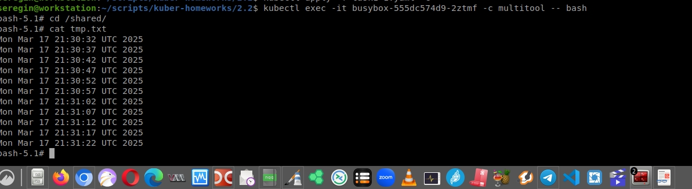
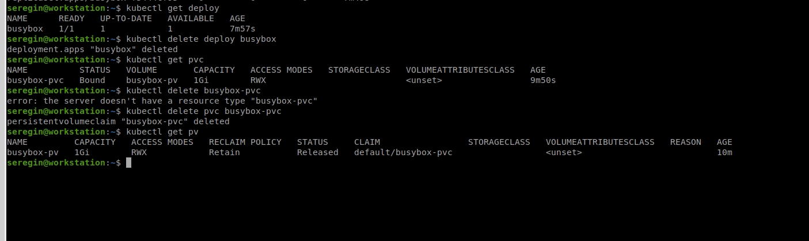
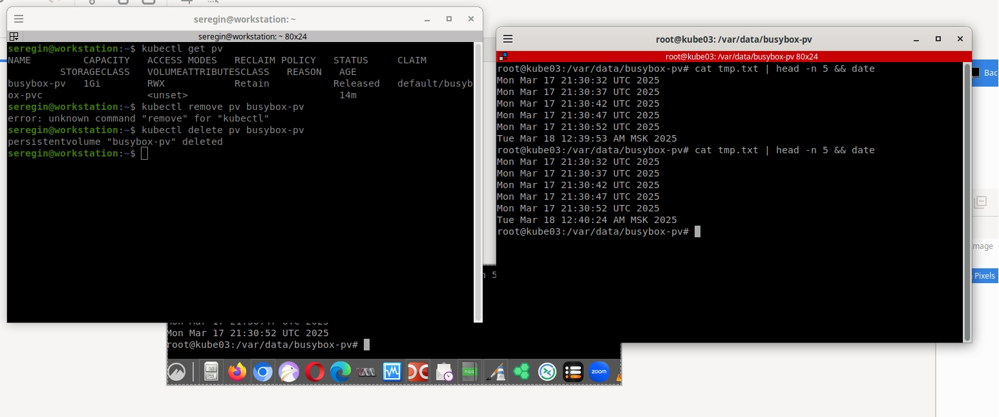
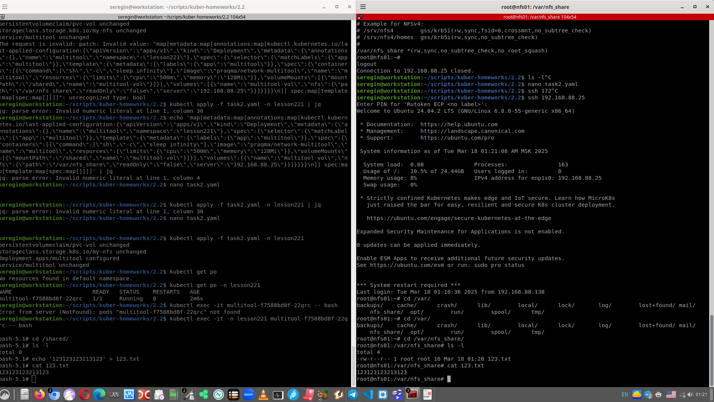

# Домашнее задание к занятию «Хранение в K8s. Часть 2»

### Цель задания

В тестовой среде Kubernetes нужно создать PV и продемострировать запись и хранение файлов.

------

### Чеклист готовности к домашнему заданию

1. Установленное K8s-решение (например, MicroK8S).
2. Установленный локальный kubectl.
3. Редактор YAML-файлов с подключенным GitHub-репозиторием.

------

### Дополнительные материалы для выполнения задания

1. [Инструкция по установке NFS в MicroK8S](https://microk8s.io/docs/nfs). 
2. [Описание Persistent Volumes](https://kubernetes.io/docs/concepts/storage/persistent-volumes/). 
3. [Описание динамического провижининга](https://kubernetes.io/docs/concepts/storage/dynamic-provisioning/). 
4. [Описание Multitool](https://github.com/wbitt/Network-MultiTool).

------

### Задание 1

**Что нужно сделать**

Создать Deployment приложения, использующего локальный PV, созданный вручную.

1. Создать Deployment приложения, состоящего из контейнеров busybox и multitool.
2. Создать PV и PVC для подключения папки на локальной ноде, которая будет использована в поде.

>3. Продемонстрировать, что multitool может читать файл, в который busybox пишет каждые пять секунд в общей директории. 



> 4. Удалить Deployment и PVC. Продемонстрировать, что после этого произошло с PV. Пояснить, почему.



PV "осиротел" - у него больше нет boundary с его PVC, в связи с чем он перешел в состояние REleased (был в boundary). 

> 5. Продемонстрировать, что файл сохранился на локальном диске ноды. Удалить PV.  Продемонстрировать что произошло с файлом после удаления PV. Пояснить, почему.

После удааления файлы на месте. Это логично, потому что это обычное поведение любого Linux-маунтпоинта. Если вдаться в подробнсости, то единственный пользователь директории удален вместе с деплоем, а kubernetes не знает, какие файлы он туда записывал или нет. Удалить директорию он также не может, тк мы ее создавали до этого.



5. Предоставить манифесты, а также скриншоты или вывод необходимых команд.

https://github.com/WilderWein123/kuber-homeworks-2.2/blob/master/task1-1.yaml

------

### Задание 2

**Что нужно сделать**

Создать Deployment приложения, которое может хранить файлы на NFS с динамическим созданием PV.

> 1. Включить и настроить NFS-сервер на MicroK8S.

В связи с тем что у меня полноценный кластер kubernetes, пришлось "повозиться" и дополнительно поднять сервер NFS по сосдству с кластером:

На стороне NFS было выполнено:

```
apt install nfs-kernel-server
mkdir /var/nfs_share
chown nobody:nogroup /var/nfs_share/ -R
echo '/var/nfs_share *(rw,sync,no_subtree_check,no_root_squash)' >> /etc/exports
exportfs -a && systemctl restart nfs-kernel-server
```

На стороне kubernetes:

```
helm repo add nfs-subdir-external-provisioner https://kubernetes-sigs.github.io/nfs-subdir-external-provisioner/
helm install nfs-subdir-external-provisioner nfs-subdir-external-provisioner/nfs-subdir-external-provisioner     --set nfs.server="192.168.88.25"     --set nfs.path="/var/nfs_share" -n nfs-share
```

2. Создать Deployment приложения состоящего из multitool, и подключить к нему PV, созданный автоматически на сервере NFS.

> 3. Продемонстрировать возможность чтения и записи файла изнутри пода. 

В правой стороне запись и чтение файла, в левой этот же файл на стороне NFS-сервера



4. Предоставить манифесты, а также скриншоты или вывод необходимых команд.


------

### Правила приёма работы

1. Домашняя работа оформляется в своём Git-репозитории в файле README.md. Выполненное задание пришлите ссылкой на .md-файл в вашем репозитории.
2. Файл README.md должен содержать скриншоты вывода необходимых команд `kubectl`, а также скриншоты результатов.
3. Репозиторий должен содержать тексты манифестов или ссылки на них в файле README.md.
